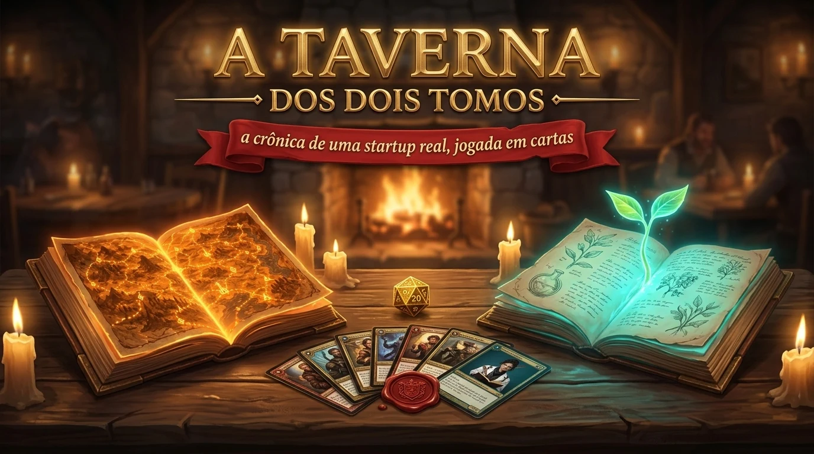

*a crônica de uma startup real, jogada em cartas*

Numa taverna à luz de velas, a turma vira a guilda de **três fundadoras** e revive a história real de uma startup brasileira de biotecnologia, a *Healthy Skin*. A cada etapa, a sala decide junto: **planejar** ou **improvisar**? O destino rola um dado, os orbes da guilda sobem ou caem, e dois velhos tomos contam o que aconteceu de verdade.

## Os dois tomos

Cada tomo é um artigo científico, e cada um tem um narrador.

| | |
|---|---|
| **O Cartógrafo — Tomo A, *O Mapa dos 20 Anos*** | **A Cronista — Tomo B, *Canvas em Movimento*** |
| Leu 38 estudos escritos em 21 anos e sabe quando as empresas costumam planejar e quando costumam improvisar. Fala em padrões: *"Nos meus mapas..."* | Acompanhou uma única empresa, de 2016 até hoje, e ouviu suas fundadoras por horas. Fala em fatos: *"Em 2019..."* |
| Kogut, Mello e Skorupski (2023) | Costa, Nelson e Pedroso (2025) |

Quem recebe a guilda é **o Taverneiro**, que explica as regras e comenta cada jogada.

## A jornada

| | |
|---|---|
| 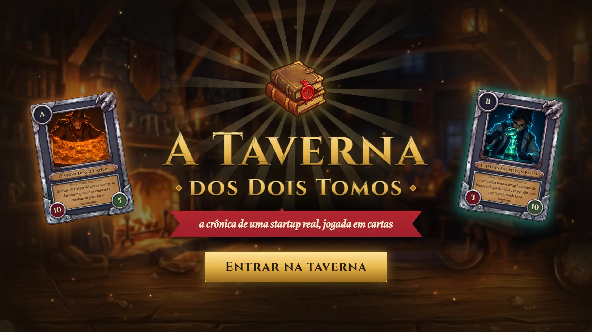 | 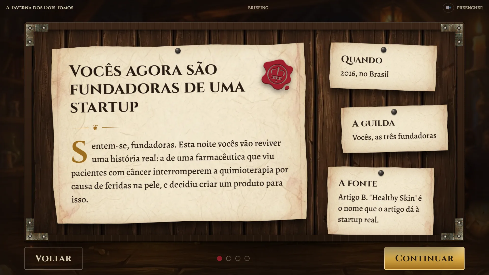 |
| **A taverna abre as portas.** O Grimório escreve a abertura e a turma entra. | **A missão.** No quadro de madeira: vocês agora são fundadoras. Os dois tomos e as cartas de decisão se apresentam. |
| 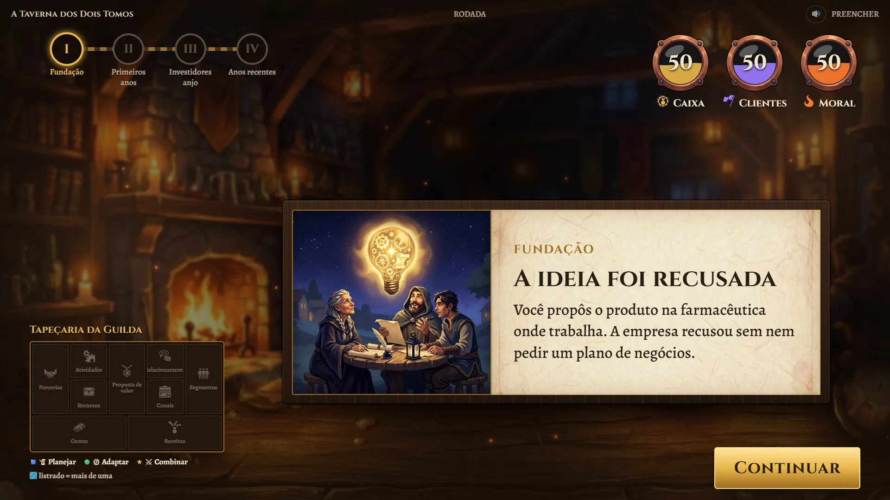 | 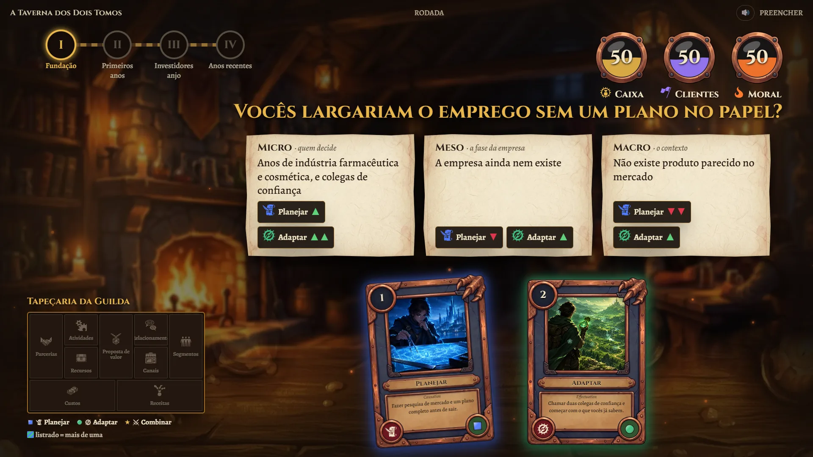 |
| **Um desafio real.** Cada etapa começa com algo que aconteceu de verdade. Na primeira: a empresa recusou a ideia. | **A votação.** O Cartógrafo lê o momento, e as setas mostram a quem o contexto favorece. A turma levanta a mão: carta 1 ou carta 2. |
| 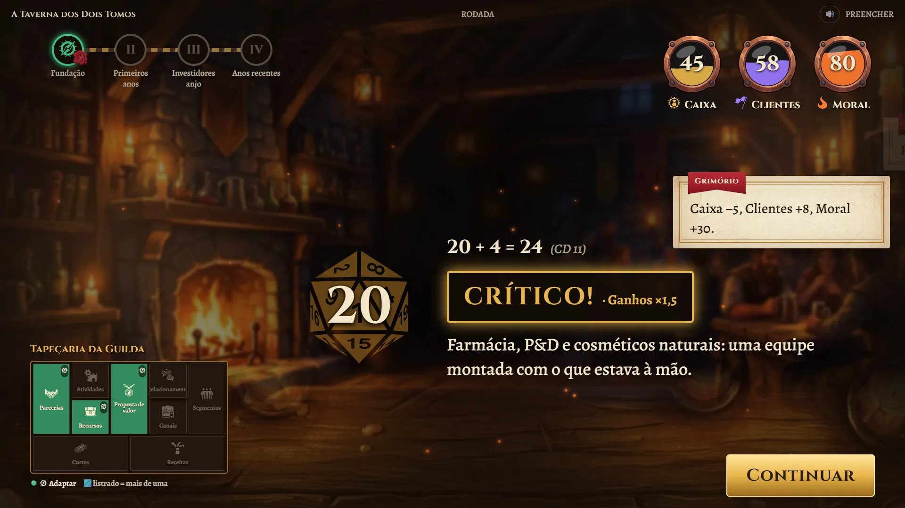 | 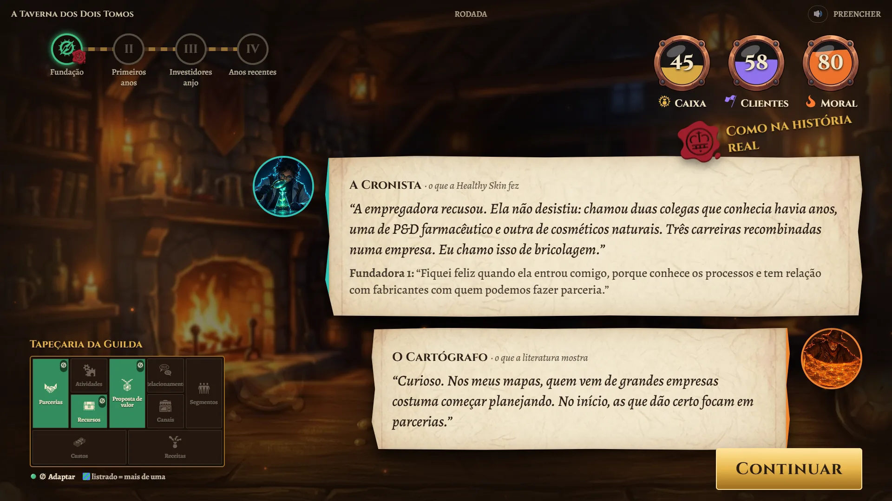 |
| **O Dado do Destino.** Um d20 decide quanto a escolha rende, com bônus de quem leu bem o mapa. Tirou 20? Crítico! | **A Crônica.** A Cronista conta o que as fundadoras fizeram, com as palavras delas, e o selo de cera diz se a turma fez igual. |
| 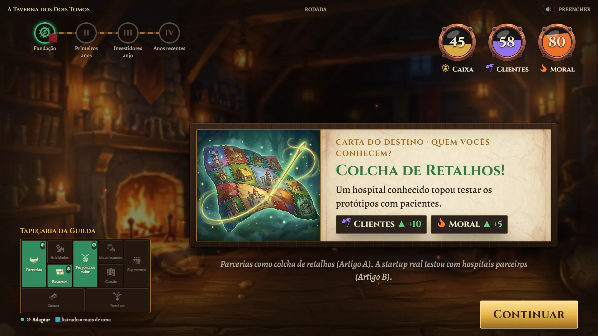 | 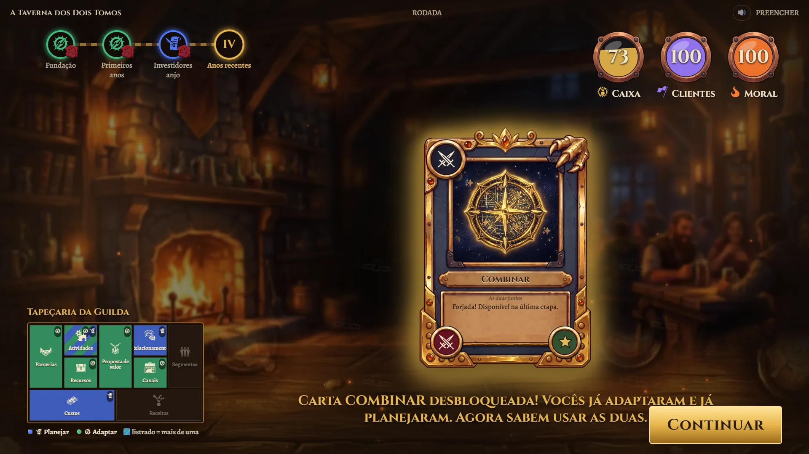 |
| **Cartas do Destino.** Parcerias, investidores, incubadora: o mundo responde às escolhas da guilda. | **A forja.** Quem já planejou e já se adaptou liberta a carta lendária **Combinar**. |
| 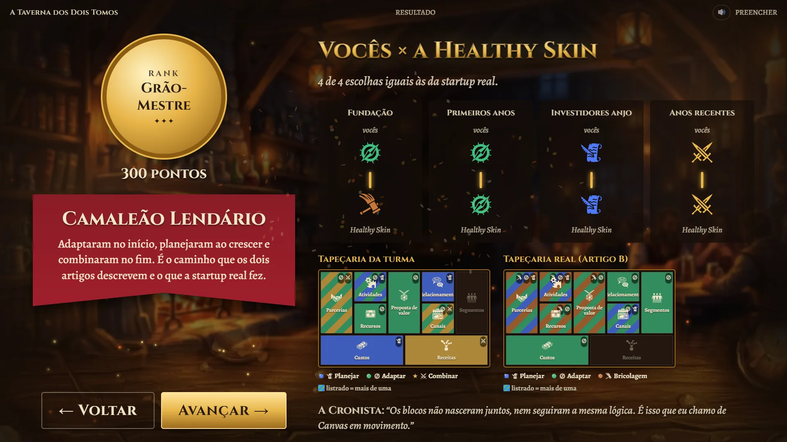 | 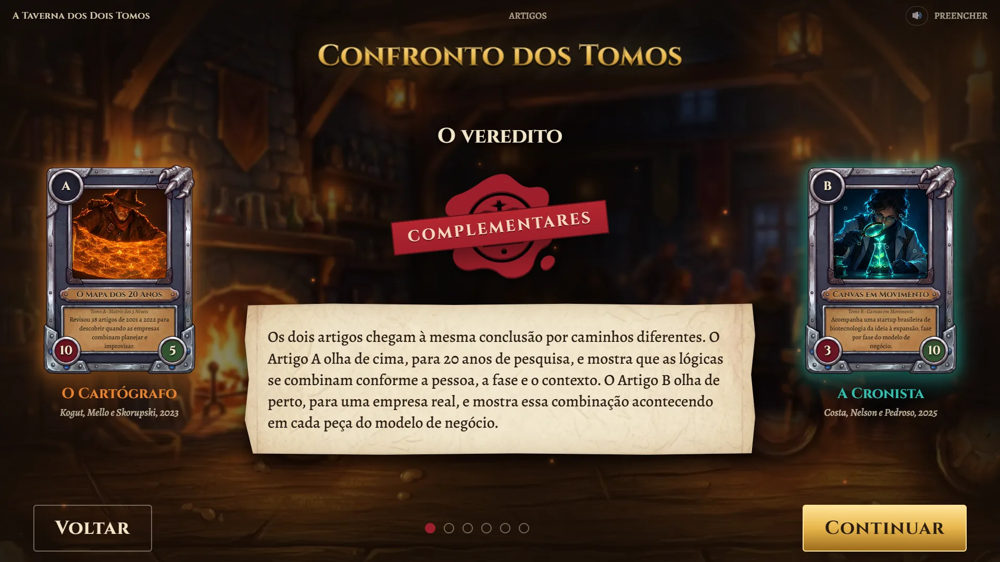 |
| **O resultado.** O rank da guilda, de Aprendiz a Grão-Mestre, e o modelo de negócio da turma ao lado do da startup real. | **O Confronto dos Tomos.** Os dois artigos frente a frente: rivais ou complementares? |
| 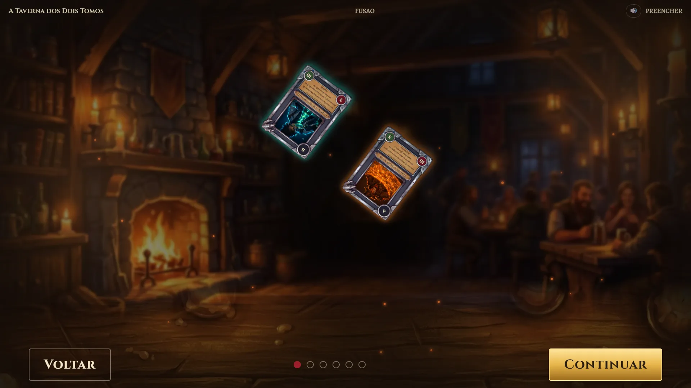 | 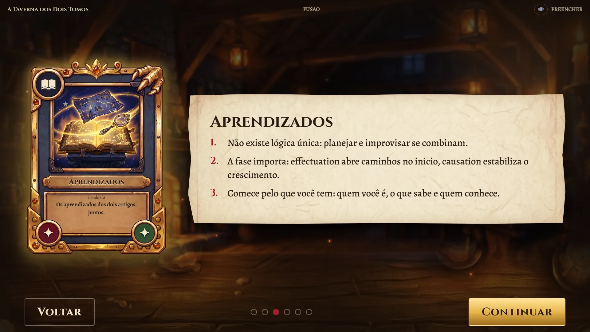 |
| **A fusão.** Os tomos giram, se fundem num clarão e nasce a carta lendária **Aprendizados**. | **O que fica.** Cinco aprendizados escritos a pena, e o Taverneiro se despede. |

## As cartas

- **Planejar** (*causation*): definir a meta, estudar o mercado, fazer o plano e executar.
- **Adaptar** (*effectuation*): começar com o que se tem, arriscar só o que pode perder, fazer parcerias.
- **Bricolagem:** fazer com o que está à mão. Aparece dentro do Adaptar, na fundação.
- **Combinar:** as duas juntas. Começa acorrentada e só é forjada por quem viveu as duas lógicas.

## A guilda

Três orbes mostram a saúde da startup: **Caixa**, **Clientes** e **Moral**. Não deixem nenhum secar. E a **Tapeçaria da Guilda**, o modelo de negócio de vocês, ganha as cores de cada escolha, bloco por bloco.

## Na sala

O jogo é feito para o projetor e dura uns 21 minutos, com a turma inteira votando. Tem música de taverna, a lareira crepitando, o murmúrio do público e o Taverneiro falando em cada momento.

Quem apresenta usa `→` para avançar, `1`/`2`/`3` para jogar a carta votada e o **botão direito** numa carta para ampliá-la para o fundo da sala, com os termos dela explicados ao lado (Causation, Effectuation, Bricolagem...). A tecla `?` mostra todos os atalhos. E vale clicar na mesa: ela levanta poeira, como o tabuleiro do Hearthstone (e reage mais a cada clique seguido).

## Os artigos

- KOGUT, C. S.; MELLO, R. D. C. de; SKORUPSKI, R. Combining effectuation and causation approaches in entrepreneurship: a 20+ years review. *REGEPE Entrepreneurship and Small Business Journal*, v. 12, n. 3, e2226, 2023.
- COSTA, R. M.; NELSON, R. E.; PEDROSO, M. C. Business model development in startups: a study of causation, effectuation and bricolage. *REGEPE Entrepreneurship and Small Business Journal*, v. 14, e2535, 2025.

---

Créditos de arte e som: [`public/assets/CREDITOS.md`](public/assets/CREDITOS.md) e [`public/sfx/CREDITOS.md`](public/sfx/CREDITOS.md). Para a equipe: [como rodar e apresentar](DESENVOLVIMENTO.md).
